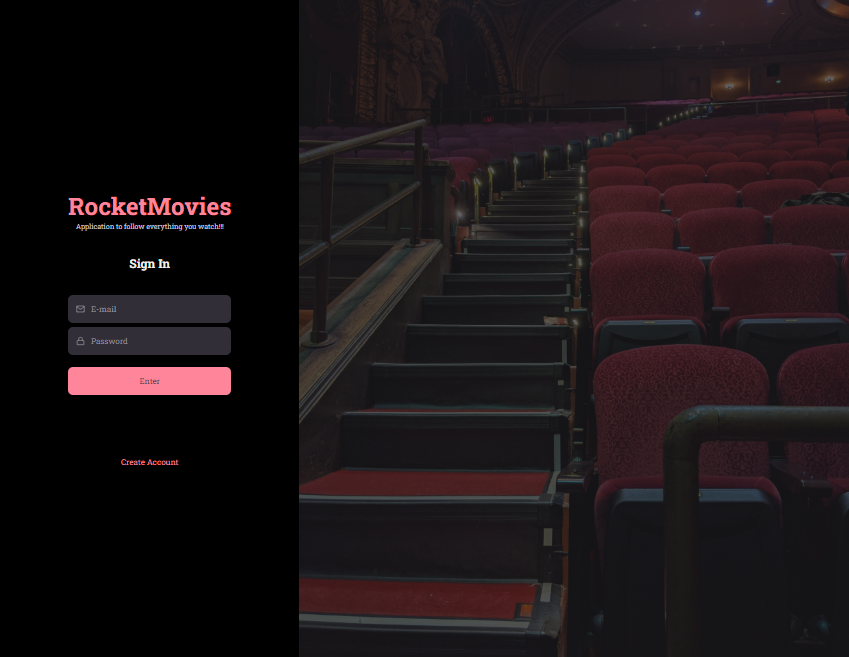

# Stage10-Front-end-Back-end-Rocketseat-Explorer
Frontend and Backend -  integration - Rocketseat-Explorer-Bootcamp

Stage 10 - API Restful => API => (Application Programming Interface) => 
Interface that provides a set of functionalities to be used/consumed.

  

###Introduction: Learning:
### Autenticação de Usuários

💻 Opening   
💻 Authentication flow  
💻 Authentication routes  
💻 JWT  
💻 Generating User Token  
💻 Token no Insomnia  
💻 Middleware  Authentication  
💻 Using Middleware

### Upload Images

💻 Configuring Upload 
💻 Disk Storage  
💻 Serving files

### Application Development
### Integration front-end and back-end

🚀 What is it API RESTful  
🚀 Cors  
🚀 Axios  
🚀 User registration  
🚀 Contexts  
🚀 Creating context  
🚀 Concept of Hooks  
🚀 Hook of Authentication  
🚀 Route Redirection  
🚀 Local Storage Concept 
🚀 Using Local Storage  

####  What did I learn after finishing this module? 👏😍

- [ ] Authentication; 🚀
- [ ] JWT; 🚀
- [ ] Middlewares; 🚀
- [ ] Upload images; 🚀
- [ ] API Restful; 🚀
- [ ] Cors; 🚀
- [ ] Axios; 🚀
- [ ] Contexts; 🚀
- [ ] Hooks; 🚀
- [ ] LocalStorage; 🚀

## Project Lay-out: Figma

[Lay-out: Figma - Docs](https://www.figma.com/file/xjeQU6sY9zeTLUzbMUAOJG/RocketMovies-(Copy)?node-id=304%3A53&t=pzGAyFVlDjn7h4Ci-0)

----------------------

### Contact

### [**Luciana Diemert**](https://github.com/ludiemert)

🛠 `Jr. Web Developer | HTML | CSS | JavaScript | ReactJS | NodeJS | Full Stack` Developer Jr.  
📍 São Jose dos Campos – SP - Brazil

&nbsp;
&nbsp;
&nbsp;
&nbsp;

 

------------------
## 🎁 Acknowledgements and dedications

* Thank you #Rocketseat team

